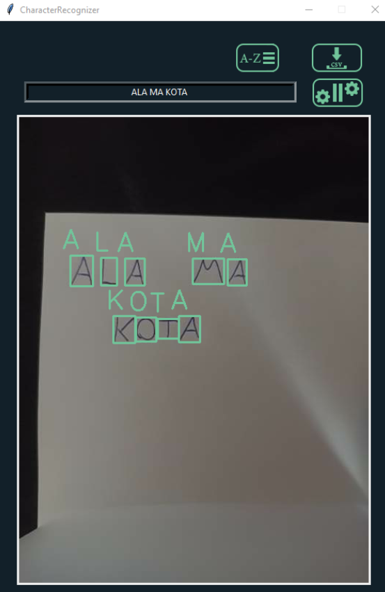
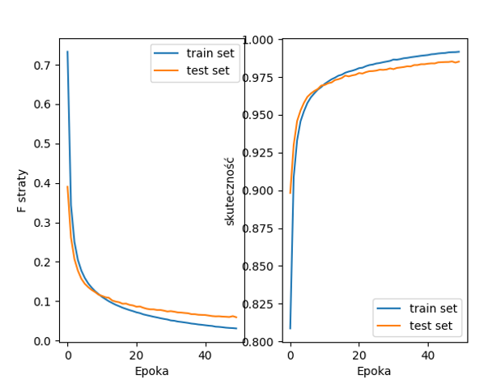

# CharRecognizer - openCv, TensorFlow, Tkinter
The program uses a webcam and a previously trained model to
recognizes letters, numbers and mathematical signs. If is an "=" sign in the recognized frame, program
tries to perform a math operation (only two-argument operations are allowed)

In addition, the program has the function of creating your own training set in the application,
select the appropriate char and then place it in the frame and save in trainData.csv.

